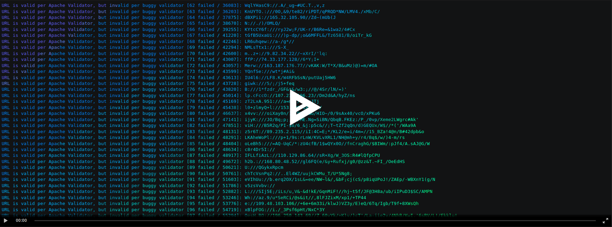

# Testing the Apache URL Validator

*Non-maven example of testing the Apache URL Validator using random URL generation*
<p align="center">
<a href="https://asciinema.org/a/175539">

</a>
</p>

## Overview

A buggy version of the Apache URL validator is tested against a reference 
[Apache Commons Validator](https://mvnrepository.com/artifact/commons-validator/commons-validator/1.5.1), 1.5.1.
Input domain partitioning (IDP), random, mutation, and static analysis are conducted.

## Random and IDP Tests

Random testing utilized the ABNF (Augmented Backus-Naur Form) metalanguage in 
[RFC3986 Appendix A](https://tools.ietf.org/html/rfc3986#appendix-A)
 for describing valid URI syntax and grammar to construct both valid and invalid random URI statements.

Input domain partitioning tests the validator with valid and invalid input from partitions of the URI construct. 
Input domain tests includs a host partition (the www.google.com part of https://www.google.com/), 
a scheme partition (the http part of http://www.google.com), 
a top level domain partition (the .com in www.google.com), 
a query partition (the q=domain in https://www.google.com/search?q=domain), 
and a port partition (the :8080 in portquiz.net:8080/).

```sh
mvn clean
mvn compile test
```

## MUTATION TESTS

The quality of test coverage was be evaluated by mutations to programs that should elicit a bug.

### Input Domain Partitioning

```sh
cd mutateIDP/
mvn org.pitest:pitest-maven:mutationCoverage
firefox mutateIDPResults.html
```

### Testing Random Testing

```sh
cd mutateRandom/
mvn org.pitest:pitest-maven:mutationCoverage
mutateRandomResults.html
```

### Tools
-[Maven](https://maven.apache.org/)
-[FindBugs (Static)](http://findbugs.sourceforge.net/)
-[Pitest (Mutation)](http://pitest.org/)

### [Full Report](REPORT.md)

## Credits
- Tiffany Smalley (IDP)
- Christopher Paul King (Mutation)
- Adrian Buenavista (Static)
- Christopher Kirchner (Random)
